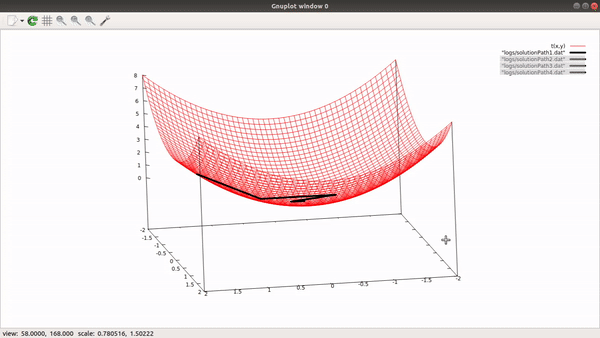

# Algopt

Algopt is a c++ implemented library which includes algorithms for optimization. It is a life-project which I am trying to build during my career in the related areas.



## Installation

To work with the libray you need to have the following:
- CMAKE>=2.8
- gnuplot
```bash
$ sudo apt-get update
$ sudo apt-get install gnuplot
```

## Available Algorithms

Currently, the library contains the following algorithms:
- Backtracking Line Search with/without wolfe condition.
- Restarting Method as a global optimizer. 


## How To Run:
* `cd build && cmake ..`
* `make`
* `./algopt`

## How to Change the Algorithms Parameters
- In the algopt.cfg configuration file, you can change the algorithms parameters values.

## Verbosity
- I am using three level for logging. You can control that by changing the verbose parameter in the algopt.cfg to one of the following values:
    * 0 : No loging / No plotting
    * 1 : Yes loging / No plotting
    * 2 : Yes loging / Yes plotting

- **NOTE**: If you want to have an interative plot, you can use the solutionPath.plt within gnuplot shell by doing the following:
    * `gnuplot`
    * `load "solutionPath.plt"`

## Project Structure:
* main.cpp 
    * Program Main.
    * You can use it to change the functions f and df you want to optimize.
    * You can even call diferent algorithm.
* randomrestartmethod.h / randomrestartmethod.cpp
    * The class represents the restarting mechanism which makes any local optimizer global one. It inherites from optimizer class.
* backtrackinglinesearch.cpp / backtrackinglinesearch.h
    * The class represents the backtracking line search algorithm which is a local optimizer and gradient-based method. It inherites from the optimizer class as well.
* optimizer.cpp / optimizer.h
    * The class represents any kind of optimization algorithm. It is a temporal class, in the future the class will be splited into localOptimizer, globalOptimizer, unconstrained and constrained optimzers. 
* utils.cpp / utils.h
    * It is a namespace which conatains some useful functions line Delta function and parsing function which gets the parameters from the algopt.cfg.
* logs
    * The directory contains all the .dat files which save the path for each optimization problem.
